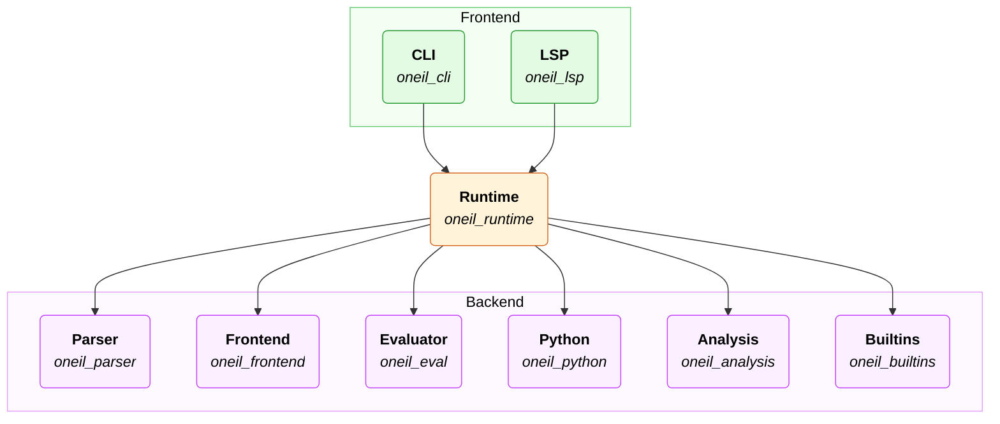

# Oneil Architecture

The Rust code lives under `src-rs/` as a single workspace. The **frontend** is what you use directly—the command-line app and editor support. The **backend** is what parses, resolves, and runs Oneil. The **`oneil_runtime`** crate ties the backend together: it loads files, keeps results in memory, and is what the CLI and language server call into.

**Data flow (simplified):** source text is parsed into an AST (**`oneil_ast`** / **`oneil_parser`**), per-file IR is produced and then composed into an `InstanceGraph` (**`oneil_ir`** / **`oneil_frontend`**), the composed graph is validated (**`oneil_analysis`**), and expressions are evaluated to values (**`oneil_eval`** / **`oneil_output`**). Standard units, prefixes, and builtins come from **`oneil_builtins`**. Optional Python interop is implemented in **`oneil_python`**. Cross-cutting types and helpers live in **`oneil_shared`**.

The pipeline is two-pass: a per-unit build pass (cached by compilation unit) produces a self-rooted `InstanceGraph` for every file or design, and a composition step clones the cached root-unit graph and overlays runtime designs to produce the graph that eval runs against. See [`../decisions/2026-04-24-two-pass-instance-graph.md`](../decisions/2026-04-24-two-pass-instance-graph.md) for the decision record and [`design-overlays.md`](design-overlays.md) for the developer-facing implementation guide.

The **`oneil`** crate is the entrypoint for external reuse. As a binary, it runs the Oneil CLI. As a library, it exports all other libraries with the `oneil_` prefix stripped.

The **`oneil_snapshot_tests`** crate is only for automated snapshot tests.

## What each crate is for

| Crate | What it does |
| --- | --- |
| **`oneil`** | Umbrella crate for downstream Rust projects: re-exports the other libraries under short names (for example `oneil::parser` instead of `oneil_parser`). The workspace default binary is the Oneil CLI. With optional features it can also build the Python extension as a shared library. |
| **`oneil_shared`** | Lowest-level shared types and helpers every crate can depend on without pulling in the rest of the compiler—things like source locations (spans), identifiers, and small utilities so the same concepts appear everywhere. |
| **`oneil_ast`** | Defines the abstract syntax tree: the data structures that represent Oneil source after lexing and parsing. The parser builds these; the resolver reads them. No execution logic—just the shape of the program as written. |
| **`oneil_ir`** | Defines the intermediate representation: a resolved, name-bound form of the program that the evaluator and analysis passes share. It sits between the raw syntax tree and running code. |
| **`oneil_output`** | Defines runtime values (numbers with units, aggregates, etc.) and how results are formatted or reported. The evaluator produces `oneil_output` values; the CLI and tools display them. |
| **`oneil_parser`** | Reads Oneil source text and produces an AST. Implemented with parser combinators (`nom`). Depends on `oneil_ast` and `oneil_shared` only—no resolution or evaluation. |
| **`oneil_frontend`** | Resolves per-file IR from the AST and runs the per-unit build pass that produces a cached `InstanceGraph` per compilation unit. Composition (cloning a cached root graph and overlaying runtime designs) also lives here. See `oneil_frontend/README.md` for crate-internal layout. |
| **`oneil_eval`** | Evaluates IR to values: the core interpreter for expressions and the dynamic semantics. Takes resolved IR and `oneil_output` types; does not parse or resolve by itself. |
| **`oneil_builtins`** | Supplies the standard environment: builtin functions, physical units, SI prefixes, and related values. Built on the evaluator and value types; the runtime installs this as the default builtins. |
| **`oneil_python`** | Bridges Oneil and Python when enabled: embedding Python values and calling into Python from evaluated Oneil code. Used from the runtime path that supports Python interop, not from the parser alone. |
| **`oneil_analysis`** | Semantic analysis and static checks over IR—extra diagnostics beyond “does it parse and resolve,” such as consistency rules the language cares about before or alongside execution. |
| **`oneil_runtime`** | The `Runtime` type and glue: caches for sources, ASTs, and per-unit `InstanceGraph`s (`UnitGraphCache`); loads files; wires parser → frontend → analysis → eval; holds builtins and optional Python state. Both **`oneil_cli`** and **`oneil_lsp`** depend on this, not on each backend crate separately. |
| **`oneil_cli`** | The command-line interface: run files, print results and errors, file watching where supported, and a command that starts the language server (via **`oneil_lsp`**). |
| **`oneil_lsp`** | Language Server Protocol server for editors: diagnostics, hover, and related features, implemented on top of **`oneil_runtime`** (async server stack). |
| **`oneil_snapshot_tests`** | Integration tests that run the runtime against fixtures and compare output to saved snapshots. Keeps behavior stable across refactors; not shipped to end users. |
