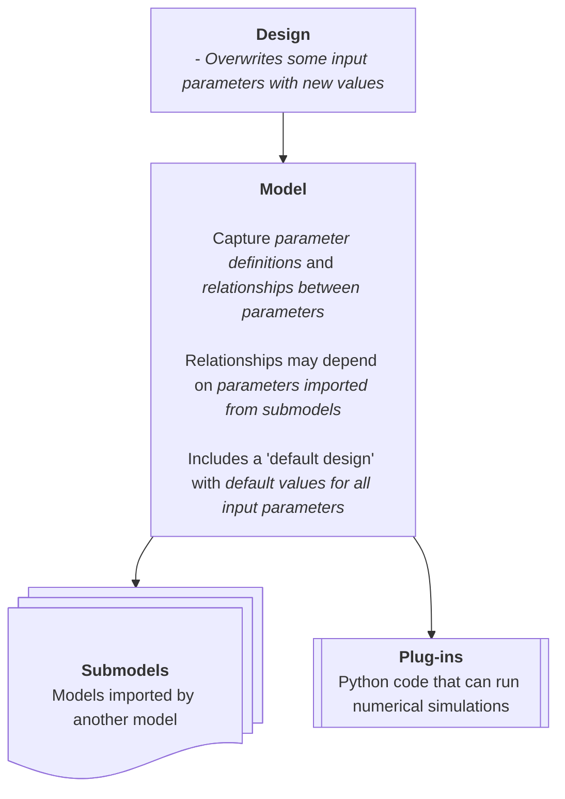

# Overview

```mermaid
flowchart TD
    design --> model
    model --> submodels
    model --> plugins
    
    design["`
        **Design**
        - _Overwrites some input parameters with new values_
    `"]

    model["
<b>Model</b><br>
Capture <i>parameter definitions</i> and <i>relationships between parameters</i><br>
Relationships may depend on <i>parameters imported from submodels</i><br>
Includes a 'default design' with <i>default values for all input parameters</i>
    "]

    submodels@{shape: docs, label: "
<b>Submodels</b>
Models imported by another model
    "}

    plugins[["
<b>Plug-ins</b>
Python code that can run numerical simulations
    "]]
```
